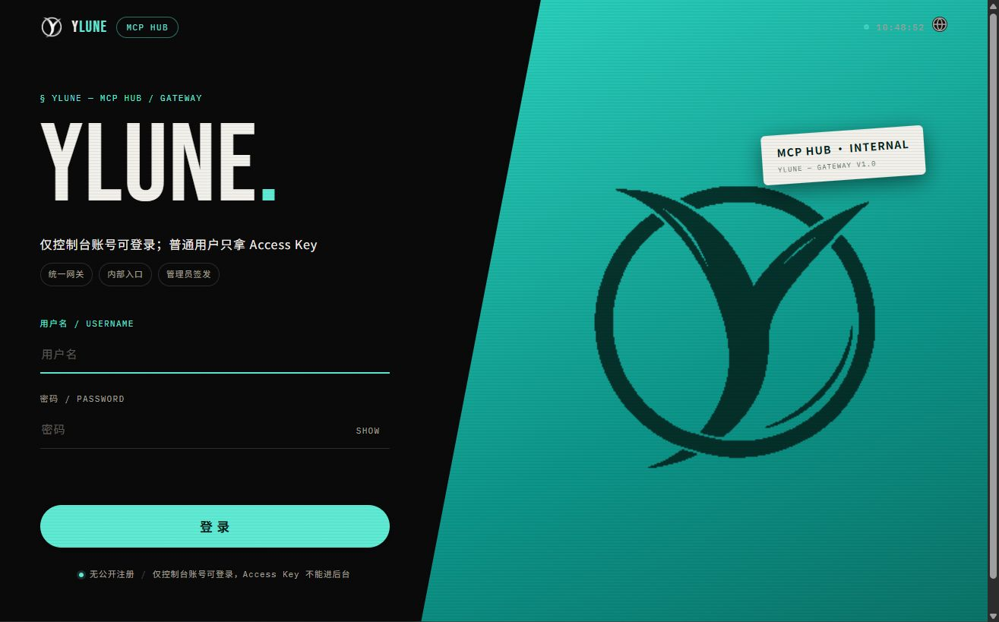
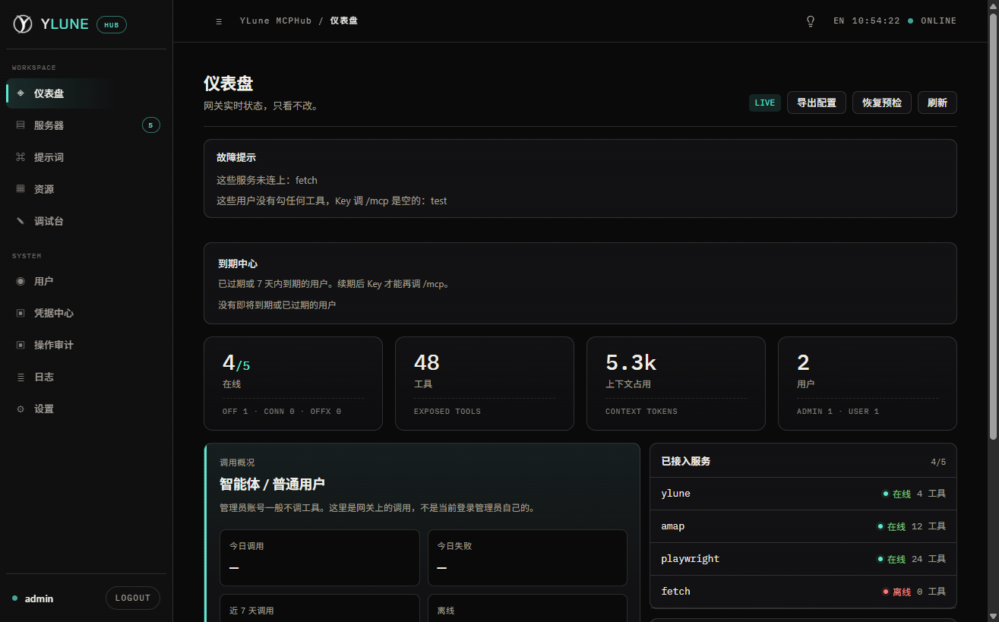
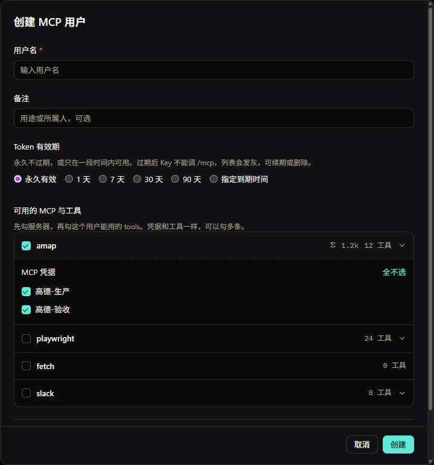
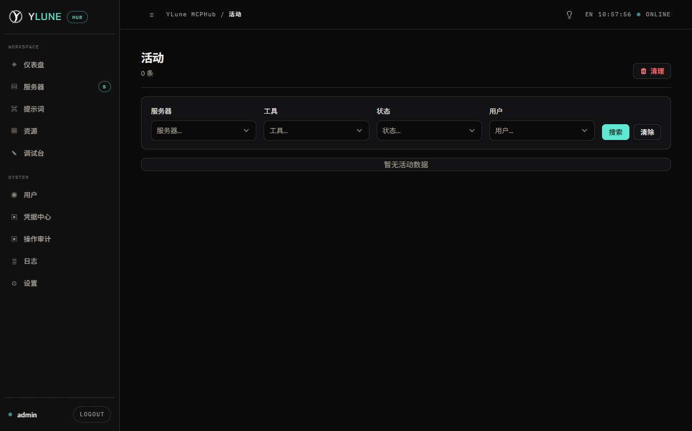

<div align="center">

<h1>YLune</h1>

<p><b>A unified MCP gateway</b> — ingest · per-user tool grants · user keys · one HTTP endpoint</p>

<p><a href="README.md">简体中文</a> · <b>English</b></p>

Point **WorkBuddy** or **Cursor** at a single HTTP MCP and use every tool you have already wired up.  
YLune runs on **your** machines: admins add servers, create users, and grant tools per user; agents only talk to `/mcp`.  
Credentials stay in the deploy environment. This repo has no tokens, passwords, or real hostnames.

<p>
  <a href="LICENSE"></a>
  <a href="https://nodejs.org/"></a>
  <a href="https://modelcontextprotocol.io/"></a>
  
</p>

<p>
  <b><a href="#quick-start">Quick start</a></b> ·
  <a href="#console">Console</a> ·
  <a href="#with-devopsmcp">With DevOpsMCP</a> ·
  <a href="#what-it-does">What it does</a> ·
  <a href="#how-it-works">How it works</a> ·
  <a href="#compatible-agents">Compatible agents</a> ·
  <a href="#who-can-call-what">Who can call what</a> ·
  <a href="#security-model">Security</a> ·
  <a href="#preview-status-and-disclaimer">Preview &amp; disclaimer</a> ·
  <a href="#docs">Docs</a>
</p>

</div>

---

On-call tools live in [DevOpsMCP](https://github.com/isYaoNoistu/DevOpsMCP): read-only Nightingale, Jenkins, and PostgreSQL stdio servers.  
**YLune does not reimplement those tools.** It ingests MCP servers you already have, grants them per user, and exposes one HTTP endpoint.

A single operator can run the three DevOpsMCP binaries directly. Use YLune when several people share one entrypoint and you need to slice tools per user.

## Console

Black console, teal accent. One screen per job.

### Login

Internal only. No public signup. Admins issue accounts. Agents do not use this page; people do.



### Dashboard

Read-only gateway status: online servers, tool count, calls from agents and regular users. Admins rarely call tools themselves. This page does not copy mcp.json, grant tools, or add servers.



### User grants

Admins tick MCP servers **and individual tools** per user. Enable a server (for example `jenkins`), then pick that user's tools. An empty list means that user's `/mcp` exposes nothing. Tokens can be permanent or time-limited; expired rows go gray and can be renewed or deleted. Admins already have every enabled server.



### Call log

One row per tool call: who, which server, which tool, success or failure, duration, source IP. Open a row to copy input / output JSON when call-body storage is on.




| Situation        | DevOpsMCP only                         | In front of YLune                                      |
| ---------------- | -------------------------------------- | ------------------------------------------------------ |
| One on-call      | Three stdio entries in `mcp.json`      | Works, but optional                                    |
| Several people   | Everyone copies paths and tokens       | Admin creates a user and ticks that user's tools       |
| Too many tools   | Clients hit tool-count limits          | Default `/mcp` is only the tools granted to that user  |
| A new teammate   | Another local config copy              | Create a user in the console and copy the `mcp.json`   |


## What it does

- **Gateway** — `/mcp`, `/mcp/{server}`, `/mcp/$smart`. Upstream: stdio, HTTP, SSE, OpenAPI.
- **Per-user grants** — Admins pick MCP servers and tools on the user page. A regular user's `/mcp` is that list; an empty list means no tools. Admins have every enabled server.
- **Users and keys** — Creating a user issues a token. Copy mcp.json from the user list any time, not only once.
- **Console** — Servers, users, settings, built-in prompts / resources, logs and activity. Private deploys hide the external market by default.
- **Optional** — Smart routing (`$smart` + pgvector), result compression, OAuth 2.0 authorization server, Better Auth, PostgreSQL config store, CLI.

Not another Nightingale / Jenkins / PostgreSQL client, and not a CMDB. Tools stay in DevOpsMCP; YLune is the front door.

## With DevOpsMCP

```
  Operator
       │
       ▼
  WorkBuddy · Cursor · …
       │  one HTTP MCP: url + Bearer
       ▼
  ┌─────────────────────────────────────┐
  │  YLune (this repo)                  │
  │  console · user grants · keys · /mcp│
  └─────────────────────────────────────┘
         │  stdio / HTTP to upstream
         ▼
  ┌─────────────────────────────────────┐
  │  DevOpsMCP (separate repo)          │
  │  nightingale · jenkins · postgres   │
  └─────────────────────────────────────┘
```

1. Build the three binaries from [DevOpsMCP](https://github.com/isYaoNoistu/DevOpsMCP) (`deploy/pack-linux.sh` or `pack-windows.cmd`) and confirm `command` / `env` locally.
2. Add them in YLune as STDIO servers (`command` = the path the YLune process can see). For Docker YLune, run DevOpsMCP `deploy/attach.sh` instead of filling three forms.
3. Create a group, tick the tools, add regular users. Do not add admins.
4. Give each user the generated `mcp.json`. They only connect to YLune.

If both clones live under `/data` and YLune runs in Docker: `docker compose up`, then `DevOpsMCP/deploy/attach.sh`. Chinese: [docs/Linux部署.md](docs/Linux部署.md).

DevOpsMCP credential rules still apply: no tokens in git; Jenkins / Nightingale tokens and database passwords stay in the runtime or `${ENV}`.

## How it works

- **Config lives in PostgreSQL.** The committed `mcp_settings.json` is an empty seed. Without `DB_URL`, dev mode writes `data/mcp_settings.dev.json` (not in git). Production requires `DB_URL`; migrate the database, not a JSON file. See [配置与数据](docs/配置与数据.md).
- Console edits apply immediately; you do not restart the gateway to add a tool.
- **Invoke follows membership, not the “public” flag.** Visibility only affects who can edit config in the console. To let `test` call Jenkins, add `test` to a group that includes Jenkins.
- System keys (`all` / `groups` / `servers` / `custom`) ignore the member list.

## Compatible agents

YLune speaks **HTTP MCP** (`url` + `Authorization: Bearer`). That is not the same as DevOpsMCP’s local stdio.


| Client           | Where config lives              | How to connect                                              |
| ---------------- | ------------------------------- | ----------------------------------------------------------- |
| **WorkBuddy**    | User or project `mcp.json`      | Copy from the console, or write `url` + bearer header       |
| **Cursor**       | `~/.cursor/mcp.json` or project | Same JSON. Confirm the server is green in the MCP panel     |
| **Codex**        | `~/.codex/config.toml`          | HTTP MCP: `url` + bearer, not `command`                     |
| **Other**        | See that product’s docs         | Any remote / HTTP MCP client can point at `/mcp`            |


Keep DevOpsMCP Skill order when diagnosing alerts, builds, or databases (list then detail; no writes unless asked).

## Quick start

Needs **Node 20+** and **pnpm**.

```bash
git clone https://github.com/isYaoNoistu/YLuneMCPHub.git
cd YLuneMCPHub
pnpm install
```

On Windows, run two terminals:

```bash
pnpm backend:dev
pnpm frontend:dev
```

Open http://127.0.0.1:5173 . API and MCP listen on http://127.0.0.1:3000 .  
Dev login is `admin` / `admin123` — **change it after first login**. Without `DB_URL`, config is `data/mcp_settings.dev.json`. Use Postgres for real work.

To bring up Postgres + YLune with Docker, follow [deploy/README.en.md](deploy/README.en.md). There is no compose file at the repo root. When both repos are under `/data` and you need DevOpsMCP inside the container, follow [docs/Linux部署.md](docs/Linux部署.md) (Chinese).

Field-by-field console guide (Chinese): [docs/使用教程.md](docs/使用教程.md).

## Who can call what


| Principal              | Default `/mcp`                         | Edit grants |
| ---------------------- | -------------------------------------- | ----------- |
| Admin                  | Every enabled server                   | Yes         |
| Regular user key       | Tools granted to that user; none if empty | No       |
| System key `all`       | Everything                             | No          |


## Security model

```
Admins mutate user grants and servers
        +
Regular users only invoke tools granted to them
        +
User keys follow that user’s grants
        +
No tokens / passwords / real hostnames in the repo
```

Change the default password before an internal rollout. Turn off skip-auth. Keep secrets in the environment as `${NAME}`.

## Preview status and disclaimer

This repo is in **preview**. Group authorization, console fields, and default route semantics may change. It is provided **as is** under [Apache License 2.0](LICENSE), with **no warranty** for production.

You deploy it and connect real MCP servers. Mis-authorization, bad credentials, agent mistakes, upstream changes, or network faults are **your responsibility**. Validate with read-only upstream accounts first.

## When to use · when not to

**Use** when you already have MCP servers (especially DevOpsMCP), several people share one entry, or you need per-user tool slices.

**Do not use** when you have no upstream MCP yet; when a single operator can run DevOpsMCP stdio directly; or when you need the gateway to trigger builds or change alert rules (YLune does not, and DevOpsMCP ships without write tools).

## Docs


| Start here                                   | Then                                                                 |
| -------------------------------------------- | -------------------------------------------------------------------- |
| [使用教程](docs/使用教程.md)                      | Every console field                                                  |
| [配置与数据](docs/配置与数据.md)                    | PostgreSQL is the store; JSON is not                                 |
| [With DevOpsMCP](#with-devopsmcp)            | [DevOpsMCP](https://github.com/isYaoNoistu/DevOpsMCP)                |
| [Docker deploy](deploy/README.en.md)         | Compose pack. Linux `/data` two-repo example (中文)：[docs/Linux部署.md](docs/Linux部署.md) |


## License

[Apache License 2.0](LICENSE). Third-party notices: [NOTICE](NOTICE). Do not commit production tokens, passwords, internal addresses, or customer names.
